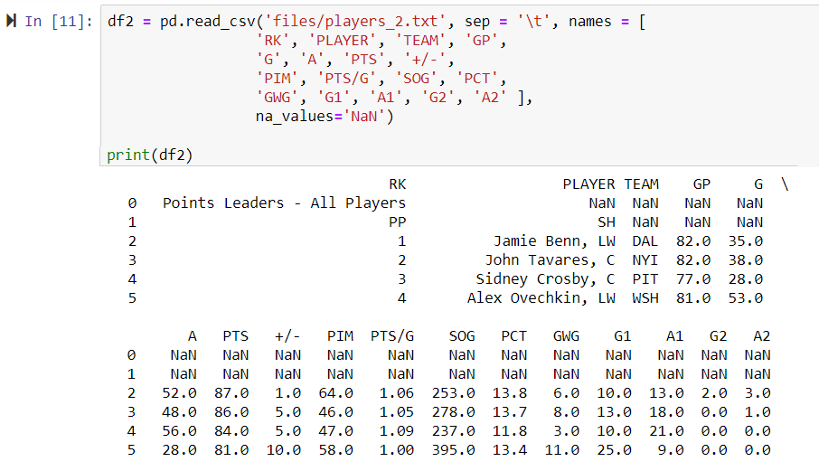
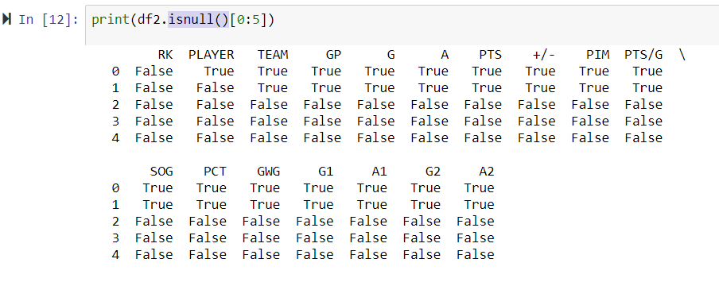
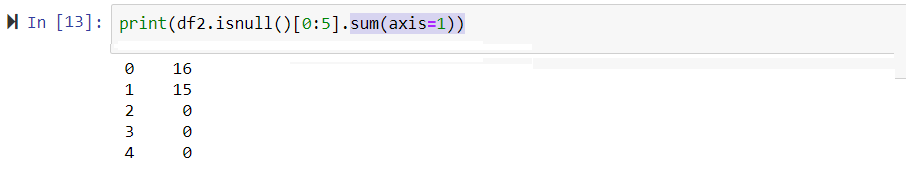

### DataFrame and JSON data

Let 'df' be a var of DataFrame type.
Assume, we do two operations:
1) write 'df' to file df.json of the JSON format
and after that
2) read df.json into the var 'df2' of DataFrame.

The only way to get exactly the same data  'df2' = 'df',
is to execute the operations  df.to_json and df2 = pd.read_json
with the parameter orient='split'.

### What about bad data ?
The function df.isnull() informs about NaNs in every cell in the table.
For example, for the following data 
 
we get  the NaN info per cells as follows:
  
At last, the total number of bad cells in every
line we get by the function df2.isnull()[:5].sum(axis=1) : 
 
Here [:5] means to get only first 5 lines of the table.
